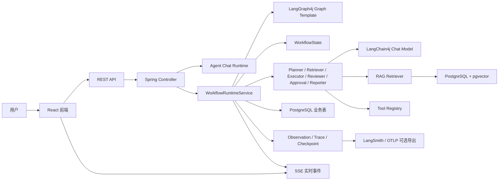
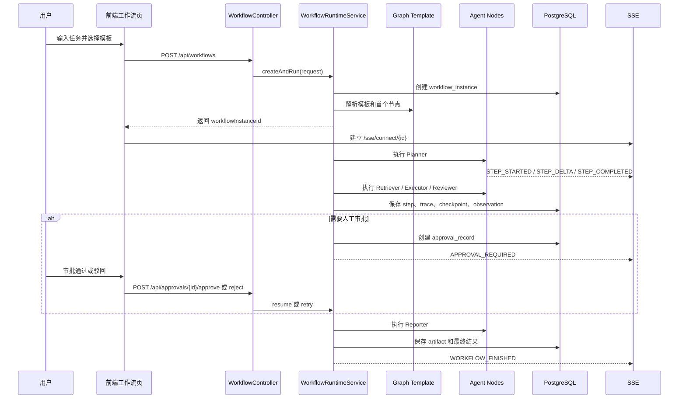

# FlowCopilot AI

> 面向复杂任务交付的多智能体执行平台。
> FlowCopilot 不只是一套聊天机器人，也不只是一个 RAG 问答 Demo，而是把“用户自然语言需求”转化为“可追踪、可审批、可重放、可沉淀产物”的 Agent 工作流系统。


## 项目简介

FlowCopilot AI 是一个基于 `Spring Boot + LangChain4j + LangGraph4j + React` 构建的智能协同执行平台。系统以自然语言作为任务入口，把一次用户需求拆解为 Planner、Retriever、Executor、Reviewer、Human Approval、Reporter 等阶段，并通过图式工作流、RAG、SSE 实时输出、人工审批、检查点、Trace 和执行产物完成闭环。

这个项目适合展示以下能力：

| 方向 | FlowCopilot 的实现方式 |
| --- | --- |
| Agent 应用 | 支持可配置 Agent、模型切换、工具调用、会话消息、异步执行 |
| RAG 知识增强 | 支持知识库、文档上传、Markdown 解析、pgvector 向量表、工作流检索节点 |
| Multi-Agent Workflow | 支持多角色节点协作、Graph 模板、条件路由、子图、审批、节点重放 |
| 人机协同 | 支持审批记录、通过后继续执行、驳回后回退到执行节点重试 |
| 可观测性 | 支持本地 Observation、Trace、Checkpoint、Token/Cost 字段和 OTLP/LangSmith 扩展 |
| 前端展示 | 支持类 ChatGPT/Gemini 的实时流式输出、工作流看板、图谱、审批和结果区 |


## 为什么做这个项目

传统 AI 聊天系统通常只解决“问一句、答一句”的问题，但真实业务里更常见的是“我要完成一件事”：

| 真实场景 | 用户想要的不是 | 用户真正需要的是 |
| --- | --- | --- |
| 写项目介绍文档 | 一段泛泛回答 | 自动拆解结构、检索知识、生成初稿、审核、输出最终文档 |
| 分析课程或业务资料 | 单次问答 | 结合知识库召回、形成结论、保留引用来源 |
| 完成需求交付 | 模型自由发挥 | 固定流程约束、关键节点可人工确认、失败可重放 |
| 答辩或汇报准备 | 一次性生成文本 | 结构化产物、执行记录、过程可解释 |

FlowCopilot 的核心目标是把大模型从“聊天助手”提升为“任务协同执行器”：模型负责推理和生成，Graph 负责流程约束，State 负责上下文传递，数据库负责持久化，前端负责过程可视化。

## 核心亮点

| 亮点 | 说明 |
| --- | --- |
| 固定骨架 + 动态决策 | 工作流不是完全写死，也不是完全交给 AI 乱跑。系统预定义合法节点和边，Agent 在约束内完成计划、检索、执行、审核与分支选择 |
| LangGraph4j 图式工作流 | 使用 Graph 模板描述节点和边，支持 Mermaid 可视化、模板编辑、条件边、子图和图结构校验 |
| LangChain4j 模型与工具层 | 通过统一模型服务接入 DeepSeek、智谱等模型，封装结构化输出、工具调用和 RAG 能力 |
| Multi-Agent 分工 | Planner Agent 负责规划，Retriever Agent 负责知识召回，Executor Agent 负责生成，Reviewer Agent 负责评审，Reporter Agent 负责发布 |
| RAG 节点化 | RAG 不再只是聊天附属能力，而是成为工作流中的标准节点，可把知识召回结果写入 State 并传递给后续 Agent |
| 人工审批闭环 | Reviewer 判断需要人工确认时，系统暂停到 Human Approval，用户可通过或驳回，驳回后回到 Executor 重试 |
| SSE 实时流式体验 | 工作流每个阶段会推送开始、增量、完成、失败等事件，前端边执行边展示，用户不需要等待最终结果 |
| Checkpoint 与 Replay | 每个关键节点前后保存状态快照，支持从指定节点重新执行，方便调试和演示“可恢复执行”能力 |
| Trace 与 Observability | 记录工作流、节点、LLM、工具和检索调用的 Span，可在本地查看，也预留 OTLP/LangSmith 导出 |
| 前后端完整闭环 | 后端提供 REST + SSE，前端提供 Agent 聊天、知识库、工作流 Graph、审批、观测和产物展示 |

## 功能总览

### Agent 聊天能力

| 功能 | 状态 | 说明 |
| --- | --- | --- |
| Agent 管理 | 已实现 | 创建、查询、更新、删除 Agent |
| 模型配置 | 已实现 | 当前内置 `deepseek-chat`、`glm-4.6` |
| 会话管理 | 已实现 | 支持按 Agent 创建和查询会话 |
| 消息管理 | 已实现 | 支持用户消息、AI 消息、工具消息持久化 |
| 工具调用 | 已实现 | 支持工具中心和 Agent 可用工具配置 |
| SSE 推送 | 已实现 | Agent 异步运行时向前端推送消息 |


### 知识库与 RAG 能力

| 功能 | 状态 | 说明 |
| --- | --- | --- |
| 知识库 CRUD | 已实现 | 管理业务知识空间 |
| 文档上传 | 已实现 | 上传文档并保存文件元信息 |
| Markdown 解析 | 已实现 | 对 Markdown 文档进行结构化拆分 |
| 向量表 | 已实现 | 使用 PostgreSQL pgvector 保存 `chunk_bge_m3` |
| 工作流检索节点 | 已实现 | Retriever Agent 可把知识召回结果写入工作流 State |
| 引用来源 | 已实现 | State 中保留 sources，前端可展示来源信息 |


### 工作流执行能力

| 功能 | 状态 | 说明 |
| --- | --- | --- |
| 创建工作流实例 | 已实现 | `POST /api/workflows` 创建任务并异步执行 |
| Graph 模板 | 已实现 | 支持内置模板和数据库模板 |
| Mermaid 图谱 | 已实现 | 后端生成 Mermaid，前端渲染工作流图 |
| 多节点执行 | 已实现 | Planner、Retriever、Executor、Reviewer、Approval、Publish |
| 子图 | 已实现 | Retriever 节点包含检索准备、知识召回、结果合并等子图步骤 |
| 并行标识 | 已实现 | Graph 模板支持子图并行组定义 |
| 人工审批 | 已实现 | 支持待审批列表、通过、驳回、驳回重试 |
| 节点重放 | 已实现 | 可从某个节点 Replay |
| 执行产物 | 已实现 | 最终结果写入 artifact |


### 可观测与调试能力

| 功能 | 状态 | 说明 |
| --- | --- | --- |
| 执行 Trace | 已实现 | 记录节点开始、完成、失败等事件 |
| Checkpoint | 已实现 | 保存工作流级、节点前后、审批等待、失败、完成快照 |
| Observation | 已实现 | 记录 workflow、node、llm、tool、retrieval 等 Span |
| Token/Cost 字段 | 已实现 | Observation 结构支持 token 与费用估算字段 |
| OTLP 导出 | 已实现配置入口 | 可通过 `flowcopilot.observability` 配置导出 |
| LangSmith 对接 | 已实现配置入口 | 通过 OTLP Endpoint 和 LangSmith API Key 进行链路追踪 |


## 总体架构



## 工作流链路



## Workflow + State 设计

FlowCopilot 采用“Graph 约束流程，State 传递上下文”的方式实现 Agent 编排。

| 概念 | 作用 | 项目中的体现 |
| --- | --- | --- |
| Graph | 定义有哪些节点、节点之间如何流转、哪些边是条件边 | `workflow/graph` 包 |
| Node | 一个可执行阶段，内部可以调用模型、工具、RAG 或人工流程 | `workflow/node` 包 |
| State | 工作流上下文，保存用户输入、计划、检索结果、草稿、审核意见、审批状态、最终结果 | `WorkflowState` |
| Checkpoint | State 的持久化快照，用于恢复、重放和调试 | `workflow_execution_checkpoint` |
| Trace | 执行过程记录，用于解释“走过哪些节点、每步是否成功” | `execution_trace_ref` |
| Observation | 更细粒度的运行观测，关注耗时、模型调用、检索、工具、成本 | `execution_observation` |

当前默认 Graph 属于“固定骨架 + 动态决策”：

| 维度 | 固定部分 | 动态部分 |
| --- | --- | --- |
| 节点 | Planner、Retriever、Executor、Reviewer、Approval、Publish | 节点内部由 AI 生成计划、内容、审核意见 |
| 边 | 模板定义合法流转关系 | 条件边根据 State 或审核结果选择 |
| 安全性 | 不允许模型任意创建不可控流程 | 模型只在系统允许范围内决策 |
| 可解释性 | 每个节点有记录、快照和状态 | 每次运行结果可通过 Trace 复盘 |

## 核心模块

| 模块 | 目录 | 作用 |
| --- | --- | --- |
| 后端主服务 | `flowcopilot` | Spring Boot 应用、API、AI 编排、数据库访问 |
| 前端应用 | `ui` | React 工作台、聊天、知识库、工作流、审批、观测页面 |
| 数据库脚本 | `flowcopilot_assert` | PostgreSQL/pgvector 初始化 SQL 和示例资料 |
| 项目文档 | `flowcopilot/docs` | Agent、RAG、接口、阶段路线和设计说明 |
| 控制器 | `flowcopilot/src/main/java/aliang/flowcopilot/controller` | REST API 入口 |
| Agent Runtime | `flowcopilot/src/main/java/aliang/flowcopilot/agent` | 传统聊天 Agent、工具调用、消息循环 |
| Workflow Runtime | `flowcopilot/src/main/java/aliang/flowcopilot/workflow` | 多智能体工作流、Graph、State、节点、审批、观测 |
| Mapper | `flowcopilot/src/main/java/aliang/flowcopilot/mapper` | MyBatis 数据访问层 |
| 前端工作流页 | `ui/src/components/views/WorkflowView.tsx` | Graph 执行看板、实时事件、审批、重放、结果展示 |

## 技术栈

### 后端

| 技术 | 版本 | 用途 |
| --- | --- | --- |
| Java | 17 | 后端开发语言 |
| Spring Boot | 3.5.10 | Web API、配置、依赖注入、异步任务 |
| MyBatis | 3.0.3 starter | PostgreSQL 数据访问 |
| PostgreSQL | 建议 14+ | 主业务数据库 |
| pgvector | SQL 扩展 | 向量检索表与向量索引 |
| LangChain4j | 1.13.0 | 模型接入、AI 服务、工具与 RAG 封装 |
| LangGraph4j | 1.8.12 | StateGraph、Graph 模板、流程拓扑 |
| OpenTelemetry | 1.47.0 | Trace 导出和可观测扩展 |
| Lombok | 1.18.32 | 实体和 DTO 简化 |
| Flexmark | 0.64.8 | Markdown 文档解析 |

### 前端

| 技术 | 版本 | 用途 |
| --- | --- | --- |
| React | 19.2 | 前端 UI |
| TypeScript | 5.9 | 类型约束 |
| Ant Design | 6.0 | 组件库 |
| Ant Design X | 2.0 | AI 聊天体验组件 |
| Vite / rolldown-vite | 7.2.5 | 前端构建 |
| Mermaid | 11.11 | 工作流图谱渲染 |
| Tailwind CSS | 4.1 | 现代化样式 |
| Vitest | 3.2 | 前端单元测试 |

## 快速开始

### 1. 环境要求

| 依赖 | 建议版本 |
| --- | --- |
| JDK | 17 |
| Node.js | 20+ |
| npm | 10+ |
| PostgreSQL | 14+ |
| pgvector | 与 PostgreSQL 版本匹配 |

### 2. 初始化数据库

默认配置连接的是本地 PostgreSQL 的 `postgres` 数据库：

```yaml
spring:
  datasource:
    url: jdbc:postgresql://localhost:5432/postgres
    username: root
    password: root
```

如果你直接使用默认库，可以执行：

```bash
psql -U root -d postgres -f flowcopilot_assert/jchatmind.sql
```

如果你想新建 `flowcopilot` 数据库，可以执行：

```bash
createdb -U root flowcopilot
psql -U root -d flowcopilot -f flowcopilot_assert/jchatmind.sql
```

然后把 `flowcopilot/src/main/resources/application.yaml` 中的数据库 URL 改成：

```yaml
spring:
  datasource:
    url: jdbc:postgresql://localhost:5432/flowcopilot
```

注意：`flowcopilot_assert/jchatmind.sql` 是历史文件名，当前仍是 FlowCopilot 的主初始化脚本。它会创建 `vector` 扩展、聊天表、知识库表、工作流表、审批表、Trace 表、Observation 表和 Checkpoint 表。

### 3. 配置模型 Key

建议通过环境变量配置，不要把真实 API Key 写进代码仓库。

```bash
export DEEPSEEK_API_KEY="your-deepseek-api-key"
export DEEPSEEK_BASE_URL="https://api.deepseek.com"
export DEEPSEEK_MODEL="deepseek-chat"
```

如果要使用智谱：

```bash
export ZHIPU_API_KEY="your-zhipu-api-key"
export ZHIPU_BASE_URL="https://open.bigmodel.cn/api/paas/v4"
export ZHIPU_MODEL="glm-4.6"
```

当前内置模型注册由 `flowcopilot.llm.providers.*` 控制。`enabled=false` 时不会注册该模型，Key 为空时也会跳过注册，因此可以先启动系统联调数据库、前端和接口，再补模型配置。

### 4. 启动后端

```bash
cd flowcopilot
export JAVA_HOME=$(/usr/libexec/java_home -v 17)
./mvnw spring-boot:run
```

后端默认地址：

```text
http://localhost:8080
```

### 5. 启动前端

```bash
cd ui
npm install
npm run dev
```

前端默认地址：

```text
http://localhost:5173
```

前端 API 默认请求：

```text
http://localhost:8080/api
```

### 6. 可选：开启 LangSmith / OTLP 观测

FlowCopilot 本地会保存 Observation。如果要把 Trace 导出到 LangSmith，可通过 Spring Boot 环境变量开启：

```bash
export FLOWCOPILOT_OBSERVABILITY_ENABLED=true
export FLOWCOPILOT_OBSERVABILITY_LANGSMITH_ENABLED=true
export FLOWCOPILOT_OBSERVABILITY_LANGSMITH_API_KEY="your-langsmith-api-key"
export FLOWCOPILOT_OBSERVABILITY_LANGSMITH_PROJECT="flowcopilot-dev"
```

如果使用普通 OTLP Collector：

```bash
export FLOWCOPILOT_OBSERVABILITY_OTEL_ENABLED=true
export FLOWCOPILOT_OBSERVABILITY_OTEL_ENDPOINT="http://localhost:4318/v1/traces"
```

## 接口速览

### Agent 与聊天

| 方法 | 路径 | 说明 |
| --- | --- | --- |
| `GET` | `/api/agents` | 查询 Agent 列表 |
| `POST` | `/api/agents` | 创建 Agent |
| `PATCH` | `/api/agents/{agentId}` | 更新 Agent |
| `DELETE` | `/api/agents/{agentId}` | 删除 Agent |
| `GET` | `/api/chat-sessions` | 查询会话 |
| `POST` | `/api/chat-sessions` | 创建会话 |
| `GET` | `/api/chat-messages/session/{sessionId}` | 查询会话消息 |
| `POST` | `/api/chat-messages` | 发送用户消息并触发 Agent |
| `GET` | `/sse/connect/{chatSessionId}` | 订阅聊天消息流 |

### 知识库

| 方法 | 路径 | 说明 |
| --- | --- | --- |
| `GET` | `/api/knowledge-bases` | 查询知识库 |
| `POST` | `/api/knowledge-bases` | 创建知识库 |
| `PATCH` | `/api/knowledge-bases/{knowledgeBaseId}` | 更新知识库 |
| `DELETE` | `/api/knowledge-bases/{knowledgeBaseId}` | 删除知识库 |
| `GET` | `/api/documents/kb/{kbId}` | 查询知识库文档 |
| `POST` | `/api/documents/upload` | 上传文档 |
| `DELETE` | `/api/documents/{documentId}` | 删除文档 |

### 工作流

| 方法 | 路径 | 说明 |
| --- | --- | --- |
| `POST` | `/api/workflows` | 创建并启动工作流 |
| `GET` | `/api/workflows` | 查询最近工作流 |
| `GET` | `/api/workflows/templates` | 查询工作流模板 |
| `PUT` | `/api/workflows/templates/{templateCode}` | 更新工作流模板 |
| `GET` | `/api/workflows/{workflowInstanceId}` | 查询工作流详情、步骤和产物 |
| `GET` | `/api/workflows/{workflowInstanceId}/steps` | 查询步骤 |
| `GET` | `/api/workflows/{workflowInstanceId}/trace` | 查询 Trace |
| `GET` | `/api/workflows/{workflowInstanceId}/checkpoints` | 查询 Checkpoint |
| `GET` | `/api/workflows/{workflowInstanceId}/observability` | 查询 Observation |
| `POST` | `/api/workflows/{workflowInstanceId}/replay/{nodeKey}` | 从指定节点重放 |
| `GET` | `/api/approvals?status=PENDING` | 查询待审批记录 |
| `POST` | `/api/approvals/{approvalRecordId}/approve` | 审批通过并继续 |
| `POST` | `/api/approvals/{approvalRecordId}/reject` | 审批驳回并重试 |
| `GET` | `/sse/connect/{workflowInstanceId}` | 订阅工作流实时事件 |

## 接口测试示例

### 创建一个工作流

```bash
curl -X POST http://localhost:8080/api/workflows \
  -H "Content-Type: application/json" \
  -d '{
    "title": "生成一份项目介绍文档",
    "input": "请根据 FlowCopilot 项目能力，生成一份面向答辩的项目介绍文档",
    "knowledgeBaseId": null,
    "templateCode": "research"
  }'
```

成功响应示例：

```json
{
  "code": 200,
  "message": "success",
  "data": {
    "workflowInstanceId": "uuid",
    "workflow": {
      "id": "uuid",
      "title": "生成一份项目介绍文档",
      "status": "CREATED",
      "currentStep": "created"
    }
  }
}
```

注意：请求字段是 `input`，不是 `userRequirement`。如果传错字段，后端会返回“Workflow input must not be blank”或“工作流输入不能为空”。

### 查询工作流详情

```bash
curl http://localhost:8080/api/workflows/{workflowInstanceId}
```

### 查询待审批记录

```bash
curl "http://localhost:8080/api/approvals?status=PENDING"
```

### 审批通过

```bash
curl -X POST http://localhost:8080/api/approvals/{approvalRecordId}/approve \
  -H "Content-Type: application/json" \
  -d '{"comment":"确认通过，可以发布"}'
```

### 从节点重放

```bash
curl -X POST http://localhost:8080/api/workflows/{workflowInstanceId}/replay/executor
```

## 项目目录

```text
.
├── flowcopilot
│   ├── docs
│   ├── src/main/java/aliang/flowcopilot
│   │   ├── agent
│   │   ├── config
│   │   ├── controller
│   │   ├── mapper
│   │   ├── model
│   │   ├── service
│   │   └── workflow
│   ├── src/main/resources
│   │   ├── application.yaml
│   │   └── mapper
│   └── pom.xml
├── flowcopilot_assert
│   ├── jchatmind.sql
│   ├── eshop.sql
│   ├── eshop_data.sql
│   └── eshop.md
├── ui
│   ├── src
│   │   ├── api
│   │   ├── components
│   │   ├── hooks
│   │   └── types
│   └── package.json
└── README.md
```

## 关键实现文件

| 文件 | 说明 |
| --- | --- |
| `flowcopilot/src/main/java/aliang/flowcopilot/FlowCopilotApplication.java` | Spring Boot 启动类 |
| `flowcopilot/src/main/java/aliang/flowcopilot/agent/JChatMind.java` | 原聊天 Agent 执行循环 |
| `flowcopilot/src/main/java/aliang/flowcopilot/agent/JChatMindFactory.java` | 根据 Agent 配置创建运行时实例 |
| `flowcopilot/src/main/java/aliang/flowcopilot/workflow/service/WorkflowRuntimeService.java` | 工作流创建、执行、审批恢复、重放、模板和观测查询 |
| `flowcopilot/src/main/java/aliang/flowcopilot/workflow/graph/WorkflowGraphRegistry.java` | 内置 Graph 模板注册与数据库模板管理 |
| `flowcopilot/src/main/java/aliang/flowcopilot/workflow/graph/LangGraph4jGraphCompiler.java` | 将模板编译为 LangGraph4j StateGraph 并生成 Mermaid |
| `flowcopilot/src/main/java/aliang/flowcopilot/workflow/state/WorkflowState.java` | 工作流节点之间共享的状态对象 |
| `flowcopilot/src/main/java/aliang/flowcopilot/workflow/node/PlannerNode.java` | 规划节点 |
| `flowcopilot/src/main/java/aliang/flowcopilot/workflow/node/RetrieverNode.java` | 知识检索节点 |
| `flowcopilot/src/main/java/aliang/flowcopilot/workflow/node/ExecutorNode.java` | 任务执行节点 |
| `flowcopilot/src/main/java/aliang/flowcopilot/workflow/node/ReviewerNode.java` | 审核节点 |
| `flowcopilot/src/main/java/aliang/flowcopilot/workflow/node/ApprovalNode.java` | 人工审批节点 |
| `flowcopilot/src/main/java/aliang/flowcopilot/workflow/node/PublishNode.java` | 最终发布节点 |
| `ui/src/components/views/WorkflowView.tsx` | 工作流前端总页面 |
| `ui/src/components/views/workflowView/WorkflowGraphCard.tsx` | Graph 图谱和模板编辑 |
| `ui/src/components/views/workflowView/WorkflowRuntimeSection.tsx` | 实时节点、审批和重放 |
| `ui/src/components/views/workflowView/WorkflowObservabilityPanel.tsx` | Trace 和 Observation 展示 |

## 数据库设计

核心表按能力分为四类：

| 类别 | 表 |
| --- | --- |
| Agent 聊天 | `agent`、`chat_session`、`chat_message` |
| RAG 知识库 | `knowledge_base`、`document`、`chunk_bge_m3` |
| 工作流执行 | `workflow_definition`、`workflow_instance`、`workflow_step_instance`、`artifact` |
| 人机协同和观测 | `approval_record`、`execution_trace_ref`、`execution_observation`、`workflow_execution_checkpoint` |

`chunk_bge_m3.embedding` 使用 `VECTOR(1024)`，并建立 `ivfflat` 索引：

```sql
CREATE EXTENSION IF NOT EXISTS vector;

CREATE INDEX idx_chunk_embedding
ON chunk_bge_m3
USING ivfflat (embedding vector_l2_ops)
WITH (lists = 100);
```

## 当前阶段状态

| 阶段 | 目标 | 状态 |
| --- | --- | --- |
| 第一阶段 | 工作流最小闭环，创建任务、执行节点、保存结果 | 已完成 |
| 第二阶段 | 多 Agent 协作、RAG 节点化、角色分工 | 已完成 |
| 第三阶段 | 人工审批、SSE 阶段流式输出、前端执行看板 | 已完成 |
| 第四阶段 | LangGraph4j Graph、模板、子图、Checkpoint、Replay、Observability | 已完成基础版 |
| 最终阶段 | 权限、团队空间、更多工具、评测、部署、商业级稳定性 | 规划中 |

> 截图占位 07：建议插入“最终产物 / Artifact 展示”截图，展示工作流生成的文档、总结或报告结果。

## 后续路线图

| 优先级 | 计划 | 价值 |
| --- | --- | --- |
| P0 | 清理配置文件中的默认密钥，统一改为环境变量 | 提升安全性 |
| P0 | 补充 Docker Compose，一键启动 PostgreSQL + pgvector + 后端 + 前端 | 降低部署成本 |
| P1 | 引入用户体系、空间和权限 | 支持多人协作和真实业务场景 |
| P1 | 增加更多工具节点，例如搜索、SQL 分析、邮件、代码执行 | 提升 Agent 执行能力 |
| P1 | 优化 RAG：多路召回、重排、引用高亮、片段评分 | 提升知识问答质量 |
| P2 | 增加 LangSmith Dataset/Evaluation | 支持效果评测和 Prompt 迭代 |
| P2 | 增加工作流模板市场 | 支持不同业务流程复用 |
| P2 | 增加异步任务队列和分布式执行 | 支持生产级并发和稳定性 |

## 常见问题

### 1. `relation "approval_record" does not exist`

说明数据库没有执行最新 SQL。请重新执行：

```bash
psql -U root -d postgres -f flowcopilot_assert/jchatmind.sql
```

如果你使用的是 `flowcopilot` 数据库，请把 `postgres` 改为 `flowcopilot`。

### 2. `database "flowcopilot" does not exist`

说明配置连接了 `flowcopilot` 数据库，但 PostgreSQL 中还没有创建它。执行：

```bash
createdb -U root flowcopilot
psql -U root -d flowcopilot -f flowcopilot_assert/jchatmind.sql
```

### 3. 模型返回 `HTTP 402 Insufficient Balance`

说明模型服务商账号余额不足或 Key 不可用。请更换 Key、充值，或临时关闭该 provider。

### 4. 工作流创建接口提示“输入不能为空”

请确认请求体字段名是 `input`：

```json
{
  "input": "你的任务描述"
}
```

不是 `userRequirement`。

### 5. Ollama 是否已内置支持

当前主线内置 DeepSeek 和智谱。Ollama 可以作为后续扩展方向，通过 LangChain4j 的模型适配层接入，但当前 README 不把它标记为已完成能力。

## 参考文档

项目内文档：

| 文档 | 说明 |
| --- | --- |
| [`flowcopilot/docs/langgraph4j-agent-platform-design.md`](flowcopilot/docs/langgraph4j-agent-platform-design.md) | 多智能体执行平台设计文档 |
| [`flowcopilot/docs/implementation-roadmap-phases.md`](flowcopilot/docs/implementation-roadmap-phases.md) | 分阶段实现路线 |
| [`flowcopilot/docs/langchain4j-api-usage-guide.md`](flowcopilot/docs/langchain4j-api-usage-guide.md) | LangChain4j 迁移和接口说明 |
| [`flowcopilot/docs/api-interface-guide.md`](flowcopilot/docs/api-interface-guide.md) | API 接口说明 |
| [`flowcopilot/docs/agent-rag-call-flow.md`](flowcopilot/docs/agent-rag-call-flow.md) | Agent 与 RAG 调用链路 |
| [`flowcopilot/docs/class-role-guide.md`](flowcopilot/docs/class-role-guide.md) | 类职责说明 |

外部参考：

| 项目 | README 借鉴点 |
| --- | --- |
| [Dify](https://github.com/langgenius/dify) | 开头定位、核心功能、快速开始、模型与 RAG 能力展示 |
| [Open WebUI](https://github.com/open-webui/open-webui) | 功能清单、部署说明、截图展示、扩展能力说明 |
| [LangChain](https://github.com/langchain-ai/langchain) | AI 应用框架说明、生态链接和开发者文档组织 |
| [LangChain4j](https://docs.langchain4j.dev/) | Java AI Services、Tools、RAG 实现参考 |
| [LangGraph4j](https://langgraph4j.github.io/langgraph4j/) | StateGraph、节点、边、状态编排参考 |
| [LangSmith](https://docs.smith.langchain.com/) | Trace、评测、可观测与 OpenTelemetry 接入参考 |

## License

本项目使用 MIT License，详见 [`LICENSE`](LICENSE)。
