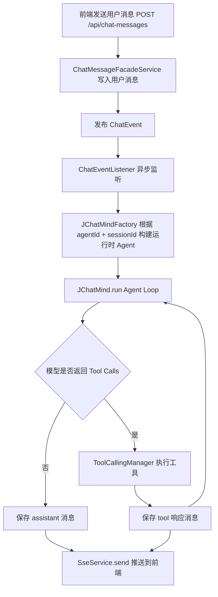

# JChatMind 核心能力详解：Agent、RAG、工具调用

## 1. 先回答你的核心问题

## 1.1 这个项目里的 Agent 是什么？

在这个项目里，Agent 不是一个固定写死的机器人类，而是“可配置的运行时智能体实例”。

每个 Agent 本质上是一份配置 + 一套执行机制：

1. 配置层（存库）：名称、系统提示词、模型、允许用哪些工具、可访问哪些知识库、模型参数。
2. 运行层（运行时构建）：收到消息后，按配置装配 ChatClient、工具回调、会话记忆，进入循环执行。
3. 交互层（对前端）：将 AI 生成消息和工具结果落库，并通过 SSE 实时推送。

所以它更接近“一个可编排的 AI 工作流实例”，而不是简单的“调用一次大模型”。

## 1.2 “添加 Agent”是什么意思？

“添加 Agent”不是新增 Java 代码类，而是新增一条 Agent 配置数据记录。

调用 `POST /api/agents` 后，会发生：

1. 把前端配置（模型、提示词、allowedTools、allowedKbs、chatOptions）转换为 DTO。
2. 再转换为数据库实体并写入 `agent` 表。
3. 其中 `allowed_tools`、`allowed_kbs`、`chat_options` 以 JSONB 存储。
4. 以后每次会话触发时，系统根据这个 `agentId` 动态构建对应的运行时 Agent。

一句话：添加 Agent = 新增一份“智能体运行配置模板”。

---

## 2. 总体架构（核心链路）

---

## 3. Agent 机制如何实现

## 3.1 Agent 配置模型

Agent 配置字段（创建/更新时）：

1. 基础信息：`name`、`description`、`systemPrompt`
2. 模型：`model`（当前支持 `deepseek-chat`、`glm-4.6`）
3. 能力边界：`allowedTools`、`allowedKbs`
4. 推理参数：`chatOptions.temperature`、`chatOptions.topP`、`chatOptions.messageLength`

这些数据最终保存在 `agent` 表，运行时再还原成结构化 DTO。

## 3.2 运行时构建（JChatMindFactory）

当事件到来，`JChatMindFactory.create(agentId, chatSessionId)` 负责组装运行环境：

1. 加载 Agent 配置（数据库 -> AgentDTO）。
2. 加载最近 `messageLength` 条会话消息，恢复成 Spring AI 的 Message 列表。
3. 解析可访问知识库：按 `allowedKbs` 查询知识库配置。
4. 解析可用工具：
   - 固定工具：系统强制注入（`FIXED`）
   - 可选工具：从 `allowedTools` 中筛选（`OPTIONAL`）
5. 将工具对象转换为 `ToolCallback`。
6. 根据 Agent 选定的 `model` 从 `ChatClientRegistry` 获取具体 `ChatClient`。
7. 构建 `JChatMind` 实例并返回。

## 3.3 Agent Loop（JChatMind.run）

`JChatMind` 内部是一个最多 20 步的循环：

1. think 阶段
   - 组装 Prompt（记忆消息 + 系统思考提示）
   - 调用模型
   - 保存 assistant 消息
   - 如果有工具调用，进入 execute
2. execute 阶段
   - 使用 `ToolCallingManager.executeToolCalls` 执行工具
   - 把工具响应写入会话记忆
   - 保存 tool 消息
   - 若调用了 `terminate`，结束循环
3. 每次保存消息后会 `refreshPendingMessages`
   - 把待推送消息转为 `SseMessage`
   - 调用 `SseService.send(chatSessionId, message)` 推送前端

## 3.4 异步触发机制

1. 用户消息通过 `POST /api/chat-messages` 入库。
2. 同步返回 `chatMessageId`。
3. 同时发布 `ChatEvent(agentId, sessionId, userInput)`。
4. `@Async @EventListener` 在异步线程池中处理事件。
5. 不阻塞主请求，前端通过 SSE 持续接收结果。

---

## 4. RAG 如何实现

## 4.1 文档入库与切分

入口：`POST /api/documents/upload`。

处理步骤：

1. 校验文件不为空。
2. 创建文档记录（拿到 `documentId`）。
3. 存储文件到 `document.storage.base-path`（默认 `./data/documents`）。
4. 写回文件路径到文档 metadata。
5. 若文件是 Markdown（`md/markdown`）：
   - 用 `MarkdownParserService` 提取标题与章节内容
   - 为每个章节构建 chunk
   - 对章节标题做 embedding
   - 写入 `chunk_bge_m3` 表

## 4.2 Embedding 与向量检索

`RagServiceImpl` 的实现：

1. 向量生成
   - 通过 WebClient 调用本地 `http://localhost:11434/api/embeddings`
   - 请求模型固定为 `bge-m3`
2. 向量检索
   - 将查询向量转为 PostgreSQL vector literal 字符串
   - 调用 `ChunkBgeM3Mapper.similaritySearch(kbId, vector, 3)`
   - SQL 使用 `embedding <-> queryVector` 距离排序，取 TopK

说明：这里依赖 PostgreSQL + pgvector，且本地要有可用 embedding 服务。

## 4.3 RAG 在 Agent 中如何被调用

不是自动“先检索再回答”，而是通过工具触发：

1. `KnowledgeTools` 提供 `KnowledgeTool`。
2. 模型在 think 阶段决定是否调用该工具。
3. 调用参数为 `kbsId` 和 `query`。
4. 工具返回相似片段文本，进入后续推理上下文。

这意味着：RAG 是 Agent 的一个能力插件，而非硬编码的固定步骤。

---

## 5. 工具调用机制如何实现

## 5.1 工具抽象

统一接口：`Tool`

1. `getName()`
2. `getDescription()`
3. `getType()`：`FIXED` 或 `OPTIONAL`

工具分类：

1. FIXED：所有 Agent 强制拥有（例如 `terminate`、`KnowledgeTool`）
2. OPTIONAL：由 Agent 配置决定是否启用（如数据库查询、发邮件）

## 5.2 工具注册与暴露

1. Spring 启动后把 `@Component` 工具注入 `List<Tool>`。
2. `ToolFacadeServiceImpl` 基于 `ToolType` 做筛选。
3. 前端通过 `GET /api/tools` 获取可选工具列表，供“添加 Agent”时勾选。

注意：

1. `DirectAnswerTool` 当前未启用 `@Component`，不会进入工具集合。
2. `FileSystemTools` 当前同样未启用。

## 5.3 运行时工具选择

在 `JChatMindFactory.resolveRuntimeTools`：

1. 先放入固定工具。
2. 再根据 Agent 的 `allowedTools` 名称匹配追加可选工具。
3. 构造成 `ToolCallback` 供模型调用。

## 5.4 工具执行

在 `JChatMind.execute`：

1. 从上一步模型响应拿到 tool calls。
2. `ToolCallingManager.executeToolCalls(prompt, lastChatResponse)` 执行。
3. 生成 `ToolResponseMessage` 并写入记忆。
4. 工具响应持久化为 role=tool 的消息并 SSE 推送。
5. 如果工具中出现 `terminate`，结束 Agent Loop。

---

## 6. “添加 Agent”对系统行为的实际影响

当你在前端“添加 Agent”并填写参数后，会直接决定运行时行为：

1. `model` 决定调用 DeepSeek 还是 GLM ChatClient。
2. `allowedTools` 决定模型可调用哪些外部能力。
3. `allowedKbs` 决定知识检索可用的数据范围。
4. `messageLength` 决定历史记忆窗口大小（上下文长度与成本的平衡）。
5. `temperature/topP` 决定回答风格稳定性与发散度。
6. `systemPrompt` 决定角色与任务边界，是行为控制的核心。

所以“添加 Agent”本质是“定义一个有边界、有能力、有策略的 AI 角色”。

---

## 7. 关键接口与职责（聚焦核心功能）

1. `POST /api/agents`
   - 新建 Agent 配置模板。
2. `POST /api/chat-messages`
   - 写入用户消息并发布异步事件，启动 Agent 执行。
3. `GET /api/tools`
   - 返回可选工具列表，供 Agent 配置。
4. `POST /api/documents/upload`
   - 文档入库、存储、Markdown 解析、向量化。
5. `GET /sse/connect/{chatSessionId}`
   - 前端建立会话级实时通道，接收 AI/工具结果。

---

## 8. 运行前置条件（否则核心功能会失败）

1. PostgreSQL 可用，且有对应业务表与向量表。
2. PostgreSQL 安装并启用 pgvector（用于 `<->` 相似度检索）。
3. 本地 embedding 服务可访问 `http://localhost:11434/api/embeddings`，并有 `bge-m3` 模型。
4. 在 `application.yaml` 配置有效的 DeepSeek/Zhipu API Key。
5. 前端建立 SSE 连接后再发消息，才能实时看到增量结果。

---

## 9. 你可以这样理解这个项目

1. Agent = 可配置的执行器（大脑 + 工具箱 + 记忆）。
2. RAG = Agent 的外部知识能力（通过工具按需调用）。
3. 工具调用 = 把模型从“只会说”升级为“会做事”。
4. 整体工程目标 = 将“会话、知识、工具、实时流”编排成一个可持续扩展的 Agent 平台。

如果你后续愿意，我可以再给你补一份“从 0 到 1 新增一个自定义工具并接入 Agent 配置页”的实战文档（包含后端与前端改造点清单）。
